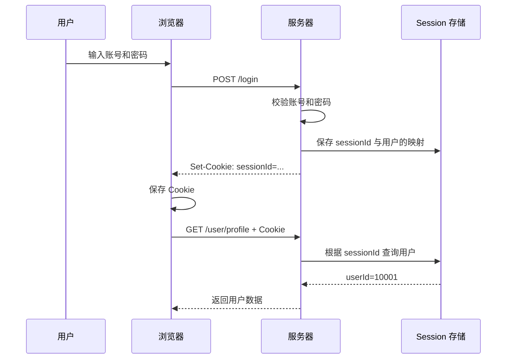

# 浏览器 Cookie 与登录状态：为什么登录一次后，下次打开仍然不用重新登录？

第一次访问网站时需要输入账号密码，之后即使关闭并重新打开浏览器，网站往往仍能识别当前用户。核心原因不是浏览器记住了密码，而是它保存了一个尚未失效的登录凭证，并在后续请求中把凭证交给服务器验证。

这套机制通常由三部分共同完成：

- Cookie 负责在浏览器中保存并按规则携带凭证。
- Session 或 Token 负责表示用户身份。
- 服务器负责判断凭证是否仍然有效。

## 一、先区分 Cookie、Session 和 Token

| 概念 | 主要职责 | 常见存放位置 |
| --- | --- | --- |
| Cookie | 浏览器保存和发送少量数据的机制 | 浏览器 |
| Session | 服务器维护的一份登录状态 | 内存、Redis、数据库等服务端存储 |
| Session ID | 查找 Session 的随机标识 | 通常放在 Cookie 中 |
| Token | 能代表身份或权限的一段凭证 | Cookie、Web Storage 或 App 安全存储 |

Cookie 不等于登录状态，Token 和 Cookie 也不是两种互斥的登录方案。Token 描述的是凭证形式，Cookie 描述的是浏览器如何保存、匹配和发送数据；JWT 也可以存放在 Cookie 中。

## 二、一次完整的 Session 登录过程



### 1. 用户提交账号和密码

```http
POST /login
Content-Type: application/json

{
  "username": "zhangsan",
  "password": "123456"
}
```

服务器完成身份校验后，生成一个随机且不可预测的 `sessionId`，并在服务端保存对应关系：

```text
abcdef123456 -> userId=10001
```

### 2. 服务器要求浏览器保存 Cookie

服务器通过响应头返回登录凭证：

```http
Set-Cookie: sessionId=abcdef123456; Path=/; HttpOnly; Secure; SameSite=Lax; Max-Age=604800
```

浏览器收到 `Set-Cookie` 后，会根据域名、路径、有效期和安全属性保存 Cookie。对于 `HttpOnly` Cookie，前端 JavaScript 不需要也无法通过 `document.cookie` 读取它。

### 3. 浏览器在后续请求中自动携带 Cookie

只要请求地址符合 Cookie 的匹配规则，浏览器就会自动添加：

```http
GET /user/profile
Cookie: sessionId=abcdef123456
```

服务器使用 `sessionId` 查询 Session，找到对应用户后，就把这次请求视为已登录请求。因此用户不需要再次提交密码。

## 三、为什么关闭浏览器后仍然保持登录？

保持登录需要同时满足两个条件：

1. 浏览器中的登录凭证仍然存在，并且会随请求发送。
2. 服务器仍然认可该凭证。

### 会话 Cookie

未设置 `Expires` 或 `Max-Age` 的 Cookie 通常称为会话 Cookie：

```http
Set-Cookie: sessionId=abcdef123456; Path=/; HttpOnly
```

它会在浏览器会话结束时失效。不过浏览器的“恢复上次会话”等行为可能恢复会话 Cookie，所以不能把“关闭窗口”简单等同于“Cookie 必然被删除”。

### 持久化 Cookie

设置 `Max-Age` 或 `Expires` 后，Cookie 可以跨浏览器会话保存：

```http
Set-Cookie: sessionId=abcdef123456; Max-Age=604800; Path=/; HttpOnly
```

`604800` 秒等于 7 天。只要 Cookie 未过期、未被清除，服务器端 Session 也仍然有效，重新打开网站时就可以继续保持登录。

“记住我”通常也是延长登录凭证生命周期，但更安全的实现往往会使用可撤销、可轮换的长期凭证，而不是直接长期复用普通 Session。

## 四、Cookie 的关键属性

| 属性 | 作用 | 注意点 |
| --- | --- | --- |
| `HttpOnly` | 禁止 JavaScript 读取 Cookie | 能降低凭证被 XSS 脚本直接窃取的风险，但不能消除所有 XSS 风险 |
| `Secure` | 只在 HTTPS 请求中发送 Cookie | 登录凭证通常应启用 |
| `SameSite` | 控制跨站请求是否携带 Cookie | 常用于降低 CSRF 风险 |
| `Domain` | 控制 Cookie 可发送到哪些主机 | 不设置时通常是仅限当前主机的 host-only Cookie |
| `Path` | 限制 Cookie 生效的 URL 路径 | 登录 Cookie 常见值为 `/` |
| `Max-Age` | 设置从当前时刻起还能存活多少秒 | `Max-Age=0` 可用于立即删除 Cookie |
| `Expires` | 设置绝对过期时间 | 与 `Max-Age` 同时存在时应注意浏览器采用的优先规则 |

常见配置示例：

```http
Set-Cookie: sessionId=abcdef123456; Path=/; HttpOnly; Secure; SameSite=Lax; Max-Age=604800
```

### SameSite 的三个常见值

- `Strict`：限制最严格，跨站导航也可能不携带 Cookie。
- `Lax`：允许部分顶级导航携带 Cookie，同时限制多数跨站子请求。
- `None`：允许跨站请求携带 Cookie，通常必须同时设置 `Secure`。

`SameSite` 不是完整的 CSRF 防护方案。系统仍应根据业务场景使用 CSRF Token、来源校验或重新认证等措施。

## 五、为什么 Cookie 还在，登录却已经失效？

浏览器保存 Cookie 和服务器认可凭证是两件事。即使开发者工具中仍能看到 `sessionId`，服务器仍可能返回：

```http
HTTP/1.1 401 Unauthorized
```

常见原因包括：

- 服务端 Session 已经过期或被主动删除。
- 用户退出登录、修改密码或被管理员踢下线。
- 账号被冻结或权限已被撤销。
- Redis、内存等 Session 存储的数据丢失。
- Cookie 的 `Domain`、`Path`、`Secure` 或 `SameSite` 与当前请求不匹配。
- 浏览器清除了 Cookie，或隐私策略阻止了 Cookie。

这说明登录状态的最终决定权在服务器，而不是浏览器。

## 六、Session 与 Token 登录

### Session 模式

浏览器通常只保存一个随机 Session ID：

```text
浏览器 Cookie                  服务器 Session 存储
sessionId=abcdef123456   ->    abcdef123456 -> userId=10001
```

优点是服务端容易主动撤销登录状态，客户端凭证也较小；代价是分布式部署时需要共享 Session 存储。

### Token 模式

服务器也可以签发 Access Token，客户端请求时主动添加：

```http
Authorization: Bearer eyJhbGciOi...
```

Access Token 通常有效期较短，Refresh Token 用于换取新的 Access Token。Token 可以由 JavaScript 从 Web Storage 读取后添加到请求头，也可以放在 `HttpOnly` Cookie 中由浏览器发送。

| 对比项 | Session | 自包含 Token（如 JWT） |
| --- | --- | --- |
| 状态主要存放位置 | 服务器 | Token 自身 |
| 客户端常见内容 | Session ID | Token |
| 服务端验证方式 | 查询 Session | 验证签名和声明 |
| 主动撤销 | 通常较直接 | 往往需要黑名单、版本号或缩短有效期 |
| 权限变化生效 | 可在下次查询时立即生效 | 可能要等 Token 过期或额外查询 |

两者没有绝对优劣，选择时要考虑主动下线、多端登录、权限实时性、分布式部署和存储成本。

## 七、Cookie 与 localStorage 的区别

| 对比项 | Cookie | localStorage |
| --- | --- | --- |
| 是否随请求自动发送 | 可以 | 不会 |
| JavaScript 是否可读 | 可通过 `HttpOnly` 禁止 | 可读 |
| 作用范围 | 受 Domain、Path、SameSite 等约束 | 按源隔离 |
| 常见风险 | CSRF、错误的作用域或生命周期 | XSS 读取凭证 |

长期登录凭证尤其是 Refresh Token，不宜在没有完整威胁建模的情况下直接放入 `localStorage`。常见选择是 `HttpOnly + Secure` Cookie，并同时做好 CSRF 和 XSS 防护。

## 八、跨源请求为什么没有携带 Cookie？

假设页面与接口不同源：

```text
页面：https://www.example.com
接口：https://api.example.com
```

使用 Fetch 发起跨源请求时，通常需要允许携带凭证：

```javascript
fetch('https://api.example.com/user', {
  credentials: 'include'
})
```

Axios 的对应配置是：

```javascript
axios.get('https://api.example.com/user', {
  withCredentials: true
})
```

服务端也需要返回明确的 CORS 响应头：

```http
Access-Control-Allow-Credentials: true
Access-Control-Allow-Origin: https://www.example.com
```

允许凭证时，`Access-Control-Allow-Origin` 不能使用通配符 `*`。此外，前端配置正确并不代表 Cookie 一定会发送，Cookie 自身的 `Domain`、`Secure`、`SameSite` 等规则仍然生效。

## 九、退出登录时发生了什么？

可靠的退出登录通常同时做两件事：

1. 服务端撤销 Session 或 Refresh Token。
2. 通过同名、同路径、同作用域的 `Set-Cookie` 删除浏览器 Cookie。

```http
Set-Cookie: sessionId=; Max-Age=0; Path=/; HttpOnly; Secure
```

只删除客户端 Cookie，其他设备或已泄露的凭证可能仍然有效；只删除服务端状态，浏览器又会继续发送一个已经失效的 Cookie。两端同时处理，状态才清晰。

## 十、登录问题排查顺序

在浏览器开发者工具中，可以从 Network 和 Application（或 Storage）面板按下面的顺序检查：

```text
登录响应是否返回 Set-Cookie
        ↓
浏览器是否成功保存 Cookie
        ↓
当前请求是否符合 Domain、Path、Secure、SameSite 规则
        ↓
请求是否实际携带 Cookie
        ↓
跨源请求的 credentials 与 CORS 是否正确
        ↓
服务器是否成功解析 Cookie
        ↓
Session 或 Token 是否仍然有效
```

不要只检查“浏览器里有没有 Cookie”。应沿着“服务端签发 → 浏览器保存 → 请求携带 → 服务端验证”的完整链路定位问题。

## 十一、安全设计要点

- 全程使用 HTTPS，登录 Cookie 启用 `Secure`。
- 登录凭证启用 `HttpOnly`，并根据业务选择合适的 `SameSite`。
- Session ID 必须足够随机，登录成功后重新生成，避免 Session 固定攻击。
- 为 Session、Access Token 和 Refresh Token 设置合理且不同的生命周期。
- 支持主动注销、凭证撤销、设备管理和密码修改后失效。
- 同时防范 XSS 与 CSRF，不能把安全性寄托在单个 Cookie 属性上。
- 对修改密码、支付等敏感操作进行重新认证或二次验证。

## 总结

登录一次后再次打开网站仍然不用输入密码，本质上是登录凭证还在延续：

```text
Cookie 负责保存和携带凭证
Session 或 Token 负责表示身份
服务器负责判断凭证是否有效
```

只要浏览器仍能发送凭证，服务器也仍然认可它，登录状态就会继续存在。Cookie 不是登录本身，而是浏览器与服务器之间传递登录凭证的一种机制。

## 来源

- [ChatGPT 共享会话：浏览器 Cookie 机制解释](https://chatgpt.com/share/6a5e40ba-2784-83e8-a8ac-5e39f9bdc788)
