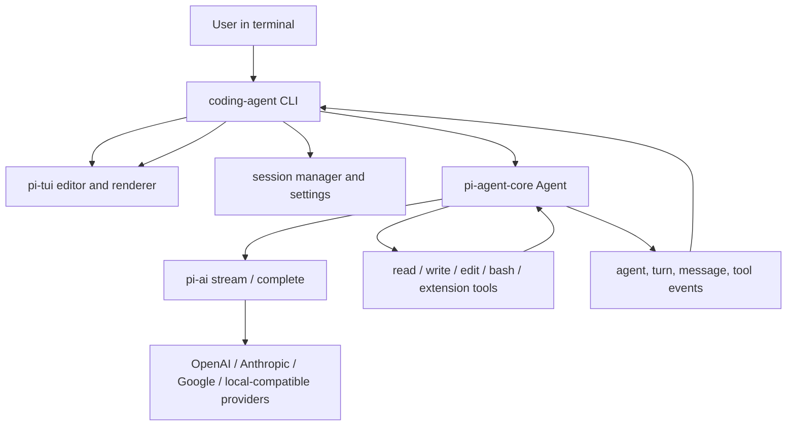

# Pi Agent Orientation

## One-Sentence Summary

Pi is a small terminal coding harness whose core can be extended through TypeScript extensions, skills, prompt templates, themes, and packages instead of being modified through forks.

## Why It Matters

Pi is useful to study because it combines several modern agent-system concerns in one TypeScript codebase:

- A terminal-first coding-agent UX.
- A reusable stateful agent runtime.
- Multi-provider LLM streaming and tool-calling abstractions.
- Tool execution, validation, hooks, session state, compaction, and branching.
- A TUI framework designed for incremental terminal rendering.
- Extension points that let users add commands, tools, providers, UI, and workflow behavior.

## Project Shape

The repository is a monorepo with npm workspaces.

| Package | Main Responsibility | Read First |
|---|---|---|
| `packages/coding-agent` | The `pi` CLI and end-user coding agent. | `README.md`, `src/cli.ts`, interactive mode code, command registration, session manager. |
| `packages/agent` | Core agent loop and state management. | `README.md`, `Agent`, `agentLoop`, tool execution, event types. |
| `packages/ai` | Provider-neutral LLM API. | `README.md`, `stream`, `complete`, model registry, provider adapters. |
| `packages/tui` | Terminal UI primitives. | `README.md`, `TUI`, `Editor`, `Markdown`, overlay and rendering code. |

## Mental Model

## Core Concepts To Master

### Agent Message vs LLM Message

The agent runtime keeps richer `AgentMessage` values for UI and app-specific state. Before calling a model, messages pass through context transformation and conversion into provider-facing LLM messages.

Learning check: explain why a UI notification should not necessarily be sent to the LLM.

### Streaming Events

Pi separates model output into events such as text deltas, tool-call deltas, completion, errors, and higher-level agent lifecycle events. This is what lets the terminal UI update continuously while the agent works.

Learning check: draw the event sequence for a prompt that calls one tool.

### Tool Execution

Tools are defined with schemas, validated before execution, and can run in parallel or sequential mode. Hooks can block or postprocess tool calls.

Learning check: explain why validating tool-call arguments belongs outside provider-specific adapters.

### Sessions And Branching

Pi stores sessions as JSONL entries with `id` and `parentId`, so users can branch conversation history without losing previous paths.

Learning check: open a session file and reconstruct the active path from parent links.

### Extension Surface

Pi keeps the default core small and expects workflow-specific behavior to live in extensions, skills, prompt templates, themes, and pi packages.

Learning check: decide whether a new feature should be a core change, extension, skill, or prompt template.

## First Source Tracing Exercise

Trace this path:

1. User types a prompt in the terminal editor.
2. CLI turns it into a user message.
3. Agent runtime starts a turn.
4. `pi-ai` streams model events.
5. Tool calls are validated and executed.
6. Tool results are appended to context.
7. Follow-up LLM turn runs if needed.
8. Events update the TUI and session file.

Write down the exact source files and functions you find for each step.

## Practical Learning Outcome

After this topic, you should be able to:

- Run Pi locally and explain its user-facing workflow.
- Explain the boundary between CLI, agent runtime, provider API, and TUI.
- Build a minimal script using `@earendil-works/pi-ai`.
- Build a minimal `Agent` with one tool using `@earendil-works/pi-agent-core`.
- Read and explain a saved session JSONL file.
- Create a tiny extension or skill and know when that is preferable to changing core code.
